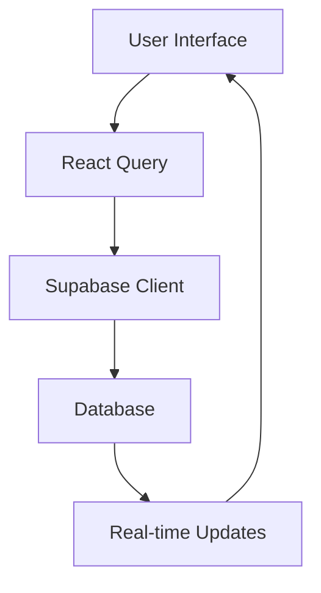

# User Dashboard Documentation

## Overview
The user dashboard provides a centralized interface for users to manage their bookings, view their history, and control their account settings.

## Implemented Features

### 1. Dashboard Layout
- ✅ Protected routes with authentication
- ✅ Responsive navigation tabs
- ✅ Localization support
- ✅ Loading states
- ✅ Error boundaries

### 2. Overview Page (`/dashboard`)
- ✅ Booking statistics (total, active, amount spent)
- ✅ Recent bookings list
- ✅ Real-time updates via Supabase

### 3. Bookings Page (`/dashboard/bookings`)
- ✅ Complete bookings list
- ✅ Status filtering
- ✅ Property search
- ✅ Pagination
- ✅ Detailed booking information
- ✅ Sorting by date

### 4. Settings Page (`/dashboard/settings`)
- ✅ Email notification preferences
- ✅ Booking reminder settings
- ✅ Marketing email opt-in/out
- ✅ Settings persistence in user profile

### 5. Data Integration
- ✅ React Query for data fetching
- ✅ Supabase real-time subscriptions
- ✅ Type-safe database operations
- ✅ proper error handling
- ✅ Loading states

## Missing Features for Production

### 1. Security & Performance
- ⚠️ Rate limiting for API calls
- ⚠️ Input sanitization
- ⚠️ Data validation middleware
- ⚠️ API request caching
- ⚠️ Performance monitoring
- ⚠️ Security headers configuration

### 2. Booking Management
- ⚠️ Booking cancellation functionality
- ⚠️ Booking modification options
- ⚠️ Rebooking from past reservations
- ⚠️ Invoice/receipt downloads
- ⚠️ Booking calendar view
- ⚠️ Multi-currency support

### 3. User Experience
- ⚠️ Advanced filtering options
- ⚠️ Export bookings to CSV/PDF
- ⚠️ Bulk actions for bookings
- ⚠️ Date range filtering
- ⚠️ Customizable dashboard layout
- ⚠️ Saved search preferences

### 4. Communication
- ⚠️ In-app notification system
- ⚠️ Email template system
- ⚠️ Direct messaging with property owners
- ⚠️ Support ticket integration
- ⚠️ Booking reminders implementation

### 5. Analytics & Reporting
- ⚠️ Booking trends visualization
- ⚠️ Spending analysis
- ⚠️ Favorite properties tracking
- ⚠️ Custom report generation
- ⚠️ Usage analytics

### 6. Testing
- ⚠️ Unit tests for components
- ⚠️ Integration tests
- ⚠️ E2E tests
- ⚠️ Performance testing
- ⚠️ Load testing
- ⚠️ Accessibility testing

### 7. Documentation
- ⚠️ API documentation
- ⚠️ Component storybook
- ⚠️ User guide/help center
- ⚠️ Error code documentation
- ⚠️ Troubleshooting guide

## Technical Implementation Notes

### Data Flow

### Type Safety
- Database types are defined in `types/database.types.ts`
- Components use TypeScript for prop validation
- API responses are properly typed

### State Management
- React Query for server state
- Local state with React hooks
- Real-time subscriptions for live updates

## Production Deployment Checklist

1. Security
- [ ] Implement rate limiting
- [ ] Add security headers
- [ ] Set up monitoring
- [ ] Configure error logging
- [ ] Add input validation

2. Performance
- [ ] Implement caching strategy
- [ ] Optimize bundle size
- [ ] Add performance monitoring
- [ ] Configure CDN
- [ ] Image optimization

3. Testing
- [ ] Write unit tests
- [ ] Add integration tests
- [ ] Perform load testing
- [ ] Run security audit
- [ ] Test all locales

4. Documentation
- [ ] Complete API documentation
- [ ] Write user guide
- [ ] Document error codes
- [ ] Create troubleshooting guide
- [ ] Add inline code documentation

## Next Steps

### Priority 1 (Critical for Production)
1. Implement security measures
2. Add comprehensive testing
3. Set up monitoring and logging
4. Add booking management features
5. Implement notification system

### Priority 2 (Important Features)
1. Analytics and reporting
2. Advanced filtering
3. Export functionality
4. Communication features
5. Help center/documentation

### Priority 3 (Nice to Have)
1. Customizable dashboard
2. Advanced analytics
3. Bulk actions
4. Additional payment integrations
5. Social features

## Maintenance Requirements

1. Regular Updates
- Security patches
- Dependency updates
- Feature improvements
- Performance optimizations

2. Monitoring
- Error tracking
- Performance metrics
- User analytics
- Security alerts

3. Backup and Recovery
- Database backups
- State recovery
- Error recovery procedures

## Support and Resources

### User Support
- Documentation needed for user guide
- FAQ section to be added
- Support ticket system to be implemented
- Chat support integration pending

### Developer Resources
- API documentation required
- Component documentation needed
- Testing guidelines to be established
- Deployment procedures to be documented