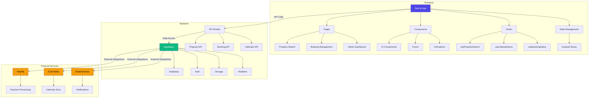

# System Architecture Diagram

## Diagram Components

### Frontend
- **Next.js App**: Core application framework
- **Pages**: Route-based page components
- **Components**: Reusable UI components
- **Hooks**: Custom React hooks for business logic
- **State Management**: Global state management with Zustand

### Backend
- **Supabase**: Backend-as-a-service platform
- **Database**: PostgreSQL database
- **Auth**: Authentication services
- **Storage**: File storage
- **Realtime**: Real-time updates
- **API Routes**: Custom API endpoints

### External Services
- **PayPal**: Payment processing
- **iCal Feeds**: Calendar synchronization
- **Email Service**: Notification system