# Feature Breakdown Diagram

```mermaid
flowchart TD
    A[Cabarete Villas Platform] --> B[Property Management]
    A --> C[Booking System]
    A --> D[User Management]
    A --> E[Admin Dashboard]
    
    B --> F[Property Listings]
    B --> G[Search & Filters]
    B --> H[Calendar Sync]
    
    F --> I[Create/Edit Listings]
    F --> J[Media Management]
    F --> K[Pricing Configuration]
    
    G --> L[Advanced Search]
    G --> M[Map Integration]
    G --> N[Saved Searches]
    
    H --> O[iCal Integration]
    H --> P[Real-time Updates]
    H --> Q[Conflict Resolution]
    
    C --> R[Booking Process]
    C --> S[Payment Integration]
    C --> T[Booking Management]
    
    R --> U[Availability Check]
    R --> V[Reservation Flow]
    R --> W[Confirmation]
    
    S --> X[PayPal Integration]
    S --> Y[Payment Tracking]
    
    T --> Z[Booking Calendar]
    T --> AA[Status Tracking]
    T --> AB[Guest Communication]
    
    D --> AC[User Profiles]
    D --> AD[Authentication]
    D --> AE[Preferences]
    
    E --> AF[Analytics]
    E --> AG[Reporting]
    E --> AH[System Settings]
    
    style A fill:#4f46e5,color:#fff
    style B fill:#3b82f6,color:#fff
    style C fill:#3b82f6,color:#fff
    style D fill:#3b82f6,color:#fff
    style E fill:#3b82f6,color:#fff
    
    style F fill:#60a5fa,color:#000
    style G fill:#60a5fa,color:#000
    style H fill:#60a5fa,color:#000
    
    style R fill:#60a5fa,color:#000
    style S fill:#60a5fa,color:#000
    style T fill:#60a5fa,color:#000
    
    style AC fill:#60a5fa,color:#000
    style AD fill:#60a5fa,color:#000
    style AE fill:#60a5fa,color:#000
    
    style AF fill:#60a5fa,color:#000
    style AG fill:#60a5fa,color:#000
    style AH fill:#60a5fa,color:#000
```

## Feature Categories

### Property Management
- **Listings**: Create and manage property listings
- **Search**: Advanced search functionality
- **Calendar**: Integration with external calendars

### Booking System
- **Process**: Complete booking workflow
- **Payments**: Secure payment processing
- **Management**: Booking tracking and management

### User Management
- **Profiles**: User account management
- **Auth**: Secure authentication
- **Preferences**: User settings and preferences

### Admin Dashboard
- **Analytics**: System performance metrics
- **Reporting**: Detailed reports
- **Settings**: System configuration