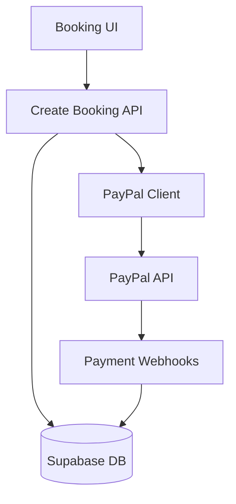

# PayPal Payment Gateway Integration (TM3.2)

## Implementation Overview
**Linked Features**: F2.3 (Secure Payment Processing)  
**Technical Module**: TM3.2-PaymentIntegration  
**Decision Reference**: D8 (Third-Party Service Integration)

### Architecture Diagram


## Core Implementation (Task 2.3.1)

### 1. Client Configuration (`lib/paypal.ts`)
```typescript
// Environment-based configuration (Decision D1)
const getApiConfig = () => ({
  clientId: process.env.PAYPAL_CLIENT_ID,
  clientSecret: process.env.PAYPAL_CLIENT_SECRET,
  mode: process.env.PAYPAL_MODE || 'sandbox'
});

// Status tracking implementation (ADHD Requirement R4.2)
const STATUS_MAP = {
  created: 'pending',
  approved: 'processing',
  completed: 'confirmed',
  failed: 'failed'
} as const;
```

### 2. Payment Flow Sequence
1. User initiates booking (F1.2-BookingSystem)
2. Create pending booking record (TM4.1-Database)
3. Generate PayPal order with tracking ID
4. Handle payment confirmation webhook
5. Update booking status (Visual feedback - D5.3)

## ADHD Considerations

### Cognitive Load Reduction
- **Status Visualization**: Color-coded payment steps in UI
- **Auto-Retry**: Failed payment recovery flow
- **Timeouts**: 15-minute payment window with reminders

```tsx
// Visual status component (Component 2.3.1-a)
<PaymentTimeline 
  currentStep={status} 
  steps={['pending', 'processing', 'confirmed']}
/>
```

## Error Handling (D5.1 Error Patterns)

| Error Type | Recovery Path | User Message |
|------------|---------------|--------------|
| API Failure | Retry 3x | "Payment service unavailable, please try again" |
| Validation | Show form | "Invalid payment details detected" |
| Timeout | Restart flow | "Payment window expired, restarting process" |

## Testing Strategy

1. **Unit Tests**: Payment status transitions
2. **Integration**: Full booking → payment flow
3. **User Testing**: ADHD focus group validation

## Dependencies

- TM1.3 (Environment Configuration)
- TM4.1 (Database Transactions)
- F1.2 (Booking System)

## Next Steps
1. Update Progress Tracker for TM3.2
2. Add PayPal sandbox credentials to onboarding docs
3. Create error recovery visual guide (Task 2.3.2)
